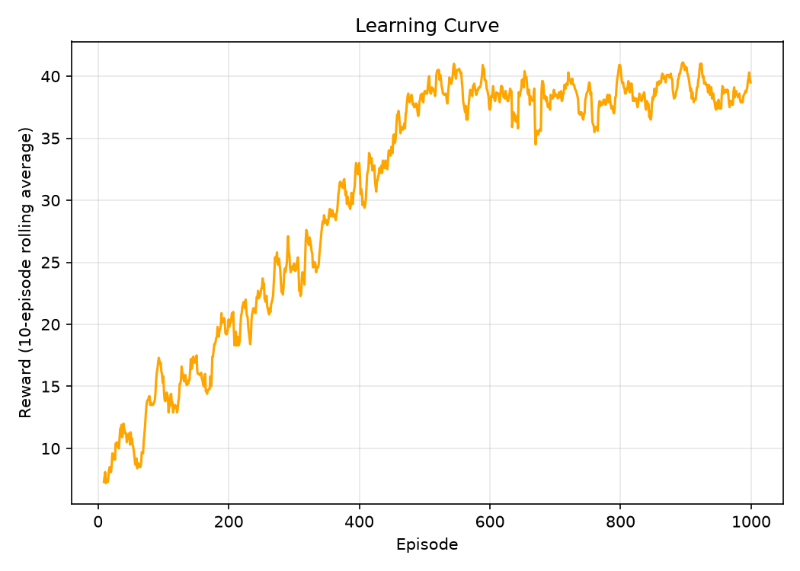

# Sheep Herd RL

Does **clustering emerge from individual foraging pressure alone**, with no reward for staying together?

Sheep Herd RL trains a single shared reinforcement-learning policy that drives many independent agents foraging on a shared, depletable 1D resource. It asks whether population size alone can push the group from independent foraging into emergent spatial clustering, without any social or cohesion reward term.

The headline result so far: inter-agent distance at the point of food scarcity is **non-monotonic in population size**. Agents collapse onto a single cell only in an intermediate density band, not at lower or higher density. This is consistent with the last remaining food patch becoming contested by the whole population as it forms; at higher `N` the fixed scarcity threshold likely triggers before agents have had time to aggregate, so part of the drop-off may be an artifact of that threshold rather than a true absence of clustering (see [Roadmap](#roadmap) item 4). 

## Model

- **Environment**: a 1D grid of `grid_size` cells (default `50`) with periodic boundaries. Each cell holds food in `[0, max_food]`; by default food does not regrow (`food_regrow_prob=0.0`), with `>0` giving stochastic per-cell regrowth.
- **Actions**: each agent independently chooses `LEFT`, `RIGHT`, `STAY`, or `EAT` (consuming one unit of food at its current cell). There is **no excluded volume**: any number of agents can occupy the same cell.
- **State (perception)**: each agent observes a single scalar, the food level at its own current cell. There is no neighbor-food, occupancy, or memory signal in the observation yet (see [Roadmap](#roadmap)).
- **Reward**: `+1` per unit of food eaten, `0` otherwise (dense, immediate); no penalty for movement.
- **Learning**: a single shared policy trained with [Stable-Baselines3](https://stable-baselines3.readthedocs.io/)'s `DQN` (an MLP policy network, the library's default replay buffer and target network). It is trained on a compressed single-agent proxy (all agents mirror one action per step during training), then deployed to drive every agent **independently** at rollout/test time via per-agent forward passes through the same network.

## Install

Requires **Python ≥ 3.11**.

```sh
git clone <repo-url> sheep_herd_rl && cd sheep_herd_rl
python3 -m venv venv && source venv/bin/activate
pip install -r requirements.txt
```

Core dependencies: `gymnasium`, `stable-baselines3` (+ `torch`), `numpy`, `pandas`, `matplotlib`.

## Run

```sh
# Train a shared DQN policy; saves to models/ and a learning-curve figure to plots/training/
python train_configurable.py --num_agents 1 --max_food 10 --max_steps 50 \
    --exploration_fraction 0.5 --total_timesteps 50000 --output model

# Roll out a trained policy for N agents over long episodes, logging inter-agent
# distance / Gini-coefficient metrics to plots/testing/ and raw_data/
python test_long.py --num_agents 10 --max_food 10 --max_steps 1000 \
    --model model_N1_F10_S50_EF0.5 --episodes 10

# Sweep population size N (re-running test_long.py per N) and aggregate the
# scaling figures into plots/probe/
python probe_scaling.py --agents 10 20 30 40 50 75 100 --episodes 5
```

`train_configurable.py` saves a rolling-average learning curve to `plots/training/` as a training sanity check:



## Parameters

| Group | Key parameters (default) |
|-------|---------------------------|
| **Environment** | `grid_size` (`50`), `max_food` (`10`), `food_regrow_prob` (`0.0`), `max_steps` (`50`); boundary periodic and excluded volume off (fixed) |
| **Multi-agent** | `num_agents` (`10`); single Q-network shared across agents, independent inference per agent at rollout |
| **DQN agent** | `learning_rate` (`1e-3`), `buffer_size` (`50000`), `batch_size` (`32`), `gamma` (`0.99`), `train_freq` (`4`), `target_update_interval` (`1000`) |
| **Exploration / training** | `exploration_fraction` (`0.3`), `exploration_final_eps` (`0.02`), `total_timesteps` (`50000`), `learning_starts` (`1000`) |

## Tech stack

- **Python ≥ 3.11**, [Gymnasium](https://gymnasium.farama.org/) for the environment API.
- **Stable-Baselines3 DQN** (PyTorch backend), no hand-rolled RL code.
- `numpy` for the environment/metrics, `pandas` + `matplotlib` for logging and figures.
- Config is CLI-argument driven per script (`argparse`), not file-based.

## Roadmap

0. ✅ Environment & shared-policy DQN wrapper: single 1D foraging environment ([environment/](environment/)), Stable-Baselines3 DQN agent ([agents/](agents/)).
1. ✅ Single-agent baseline: confirm the shared policy learns to forage (`train_configurable.py`).
2. ✅ Multi-agent rollout: `N` agents driven independently from one shared network (`test_long.py`); no excluded volume.
3. ✅ Population-scaling probe: sweep `N = 10..100`, measure inter-agent distance at food scarcity; found non-monotonic clustering, `N ≈ 30-40` (`probe_scaling.py`).
4. ◯ Systematic scaling study: replace the fixed `max_food` and the `N`-dependent scarcity threshold with more realistic, density-aware definitions (e.g. `max_food` scaled with `N`, an absolute rather than relative scarcity trigger), to separate genuine clustering from the threshold artifact seen at high `N`.
5. ◯ State/perception sweep: extend the observation beyond own-cell food (neighbor food/occupancy, memory of the previous cell) and test how each addition reshapes collective behavior.

## References

This project's design, a shared policy, a population-size sweep, and foraging as the sole driver of spatial structure, follows Durve, Peruani & Celani (2020); the density/resource-distribution framing draws on López-Incera et al. (2020) and Chirkov & Romanczuk (2025); the "selfish herd" reading of the clustering result follows Hamilton (1971).

- Durve, M., Peruani, F., & Celani, A. (2020). Learning to flock through reinforcement. *Physical Review E*, 102(1), 012601.
- López-Incera, A., Ried, K., Müller, T., & Briegel, H. J. (2020). Development of swarm behavior in artificial learning agents that adapt to different foraging environments. *PLoS ONE*, 15(12), e0243628.
- Chirkov, V., & Romanczuk, P. (2025). Social information quality determines learned collective foraging strategies. *bioRxiv* 2025.11.14.688412.
- Hamilton, W. D. (1971). Geometry for the selfish herd. *Journal of Theoretical Biology*, 31(2), 295–311.
